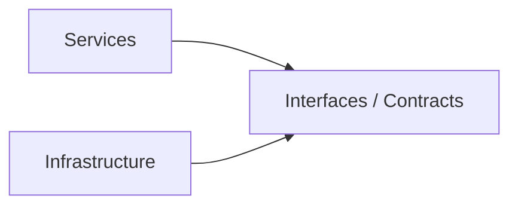
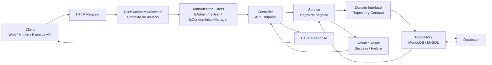
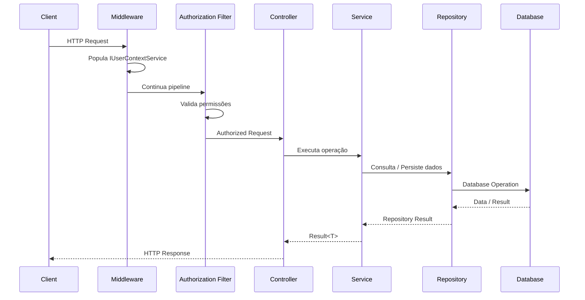
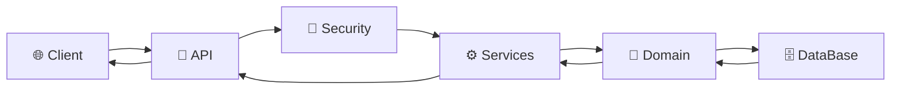

# 🏢 CondoHub

**CondoHub** é uma plataforma ERP para **gestão condominial**, desenvolvida com foco em organização, escalabilidade, segurança e separação de responsabilidades.

O projeto foi estruturado seguindo princípios de **Clean Architecture, SOLID, Design Patterns e Dependency Injection**, buscando manter o domínio desacoplado de detalhes de infraestrutura e facilitar a evolução da aplicação.

---

## 📋 Sobre o projeto

Administrar um condomínio envolve diferentes processos administrativos, financeiros e operacionais que frequentemente acabam distribuídos entre planilhas, sistemas isolados e processos manuais.

O CondoHub propõe centralizar essas operações em uma única plataforma, permitindo que diferentes perfis de usuários — como **síndicos, administradoras, moradores e funcionários** — tenham acesso às funcionalidades correspondentes às suas responsabilidades.

A aplicação foi projetada como uma **API REST**, servindo como backend para futuras aplicações web, mobile ou outros consumidores.

---

## 🎯 Objetivos

O projeto tem como principais objetivos:

- Centralizar informações do condomínio;
- Automatizar processos administrativos;
- Reduzir processos manuais e retrabalho;
- Garantir controle de acesso baseado em perfil;
- Facilitar a manutenção e evolução do código;
- Permitir integração com diferentes fontes de dados;
- Manter as regras de negócio independentes da infraestrutura.

---

# 🏗️ Arquitetura

O CondoHub utiliza uma arquitetura baseada em **separação de responsabilidades**, buscando manter as regras de negócio desacopladas de detalhes de infraestrutura.

```mermaid
flowchart TB

    API["CondoHub.API<br/>Controllers • Middleware • Filters"]

    SERVICES["CondoHub.Services<br/>Application Services<br/>Regras de negócio"]

    DOMAIN["CondoHub.Domain<br/>Entities • Interfaces<br/>Contracts • Results"]

    DATABASE["CondoHub.DataBase<br/>Repositories • Persistence<br/>Database Connections"]

    SECURITY["CondoHub.Security<br/>Authentication • Authorization<br/>Security Helpers"]

    TESTS["CondoHub.Tests<br/>Automated Tests"]

    API --> SERVICES
    API --> SECURITY
    SERVICES --> DOMAIN
    DATABASE --> DOMAIN
    SECURITY --> DOMAIN
    TESTS --> API
    TESTS --> SERVICES
    TESTS --> DOMAIN


### Responsabilidade de cada camada

| Projeto               | Responsabilidade                                              |
| --------------------- | ------------------------------------------------------------- |
| **CondoHub.Domain**   | Entidades, contratos, interfaces e abstrações do domínio      |
| **CondoHub.Services** | Regras de negócio e serviços da aplicação                     |
| **CondoHub.DataBase** | Persistência e acesso às fontes de dados                      |
| **CondoHub.Security** | Autenticação, autorização e recursos relacionados à segurança |
| **CondoHub.API**      | Exposição dos endpoints REST e integração entre as camadas    |
| **CondoHub.Tests**    | Testes automatizados                                          |

### Dependências entre camadas

A direção das dependências foi pensada para manter o **Domain independente da infraestrutura**:

```mermaid
flowchart LR

    subgraph Presentation["Presentation"]
        API["CondoHub.API"]
    end

    subgraph Application["Application"]
        SERVICES["CondoHub.Services"]
    end

    subgraph Core["Core"]
        DOMAIN["CondoHub.Domain"]
    end

    subgraph Infrastructure["Infrastructure"]
        DB["CondoHub.DataBase"]
        SECURITY["CondoHub.Security"]
    end

    API --> SERVICES
    API --> SECURITY
    SERVICES --> DOMAIN
    DB --> DOMAIN
    SECURITY --> DOMAIN
```

> **Princípio central:** as regras de negócio não devem depender diretamente de banco de dados, HTTP ou detalhes de infraestrutura.

---

# 🧩 Design Patterns

O projeto utiliza diferentes padrões de projeto para resolver problemas recorrentes de arquitetura e organização de código.

### Repository Pattern

O acesso aos dados é abstraído por interfaces definidas no domínio.

Exemplos:

```text
ICondominiumMongoRepository
ILogRepository
```

Isso permite que a camada de negócio trabalhe com contratos em vez de depender diretamente da implementação do banco de dados.

---

### Factory Method

Utilizado para encapsular a criação de determinados objetos e resultados.

Exemplos:

```csharp
Result<T>.Success()
Result<T>.Failure()

ResultList<T>.Success()
ResultList<T>.Failure()
```

Também é utilizado na criação de conexões através da:

```text
DbConnectionFactory
```

---

### Dependency Injection

As dependências da aplicação são registradas e centralizadas através das configurações:

```text
ConnectionsConfiguration
UseCasesConfiguration
```

Isso facilita:

* substituição de implementações;
* testes automatizados;
* manutenção;
* redução de acoplamento.

---

### Middleware Pipeline

O `UserContextMiddleware` participa do pipeline HTTP para processar informações relacionadas ao usuário autenticado e disponibilizá-las através do:

```text
IUserContextService
```

---

### Action Filters / Authorization

A autorização baseada em perfil é encapsulada em atributos específicos:

```text
IsAdminAttribute
IsUserAttribute
IsCondominiumManagerAttribute
```

Dessa forma, regras de autorização podem ser aplicadas diretamente aos endpoints sem duplicar a lógica de validação.

---

### Context Object

O contexto do usuário autenticado durante uma requisição é centralizado através de:

```text
IUserContextService
UserContextService
```

Isso evita que informações relacionadas ao usuário precisem ser propagadas manualmente entre diferentes componentes.

---

### Result Pattern

O projeto utiliza `Result` como uma forma estruturada de representar sucesso e falha em operações esperadas.

Principais abstrações:

```text
Result
Result<T>
ResultList<T>
```

Além disso, o `ResultLogger` permite integrar o tratamento de resultados ao sistema de logging através de Dependency Injection.

---

### API Versioning

Os endpoints são organizados por versão:

```text
Controllers/
├── V1/
├── V2/
└── V3/
```

Isso permite evoluir contratos da API mantendo versões anteriores disponíveis quando necessário.

---

# 🧱 Princípios SOLID

A arquitetura do CondoHub busca aplicar os cinco princípios SOLID.

### S — Single Responsibility Principle

Cada componente possui uma responsabilidade bem definida.

Por exemplo:

* Repositories → acesso a dados;
* Services → regras de aplicação;
* Filters → autorização;
* Controllers → exposição HTTP.

---

### O — Open/Closed Principle

A estrutura permite adicionar novas implementações e comportamentos sem modificar componentes existentes desnecessariamente.

Um exemplo é a possibilidade de adicionar novas implementações de interfaces de repositório mantendo os consumidores desacoplados da implementação concreta.

---

### L — Liskov Substitution Principle

As implementações concretas respeitam os contratos definidos pelas interfaces, permitindo que sejam substituídas sem alterar o comportamento esperado pelos consumidores.

---

### I — Interface Segregation Principle

As interfaces são divididas de acordo com suas responsabilidades, evitando contratos excessivamente grandes e componentes dependentes de métodos que não utilizam.

---

### D — Dependency Inversion Principle

As regras de negócio dependem de **abstrações**, e não de implementações concretas.



A composição das implementações concretas acontece na camada de entrada da aplicação.

---

# 🔐 Segurança

A aplicação possui uma camada dedicada a recursos de segurança:

```text
CondoHub.Security
```

A autorização é organizada de acordo com o perfil e contexto do usuário, permitindo restringir funcionalidades específicas da aplicação.

Entre os componentes utilizados estão:

* autenticação;
* autorização;
* contexto do usuário;
* filtros de autorização;
* controle de acesso por perfil.

---

# 🗄️ Persistência

O projeto utiliza abstrações de repositório para desacoplar as regras de negócio da tecnologia de persistência.

A arquitetura permite trabalhar com diferentes fontes de dados, incluindo cenários envolvendo:

* **MongoDB**
* **MySQL**

O objetivo dessa abordagem é evitar que decisões relacionadas à persistência contaminem as regras de negócio da aplicação.

---

# 👥 Perfis de usuário

O sistema foi projetado para atender diferentes perfis dentro da gestão condominial:

* 👔 Síndico
* 🏢 Administradora
* 🏠 Morador
* 🛡️ Porteiro / Atendimento
* 💰 Financeiro
* 🔧 Manutenção

Cada perfil pode possuir permissões e funcionalidades específicas de acordo com as regras de negócio da aplicação.

---

# 📦 Módulos

A plataforma pode centralizar diferentes áreas da administração condominial, como:

### 🏠 Moradores e unidades

* Cadastro de moradores;
* Associação entre moradores e unidades;
* Controle de dependentes;
* Vagas e informações da unidade;
* Histórico cadastral.

### 💰 Financeiro

* Controle de pagamentos;
* Boletos e cobranças;
* Despesas;
* Extratos;
* Situação financeira das unidades.

### 📋 Ocorrências e chamados

* Abertura de ocorrências;
* Registro de solicitações;
* Controle de status;
* Histórico de atendimento.

### 🏊 Reservas

* Reserva de áreas comuns;
* Controle de disponibilidade;
* Regras de utilização;
* Histórico de reservas.

### 📁 Documentos

* Documentos administrativos;
* Contratos;
* Atas;
* Registros internos.

### 📢 Comunicação

* Comunicados;
* Avisos;
* Notificações;
* Informações direcionadas por perfil.

---

# 🛠️ Tecnologias

Principais tecnologias e conceitos utilizados no projeto:

* **C#**
* **.NET / ASP.NET Core**
* **REST API**
* **MongoDB**
* **MySQL**
* **JWT**
* **Swagger / OpenAPI**
* **Dependency Injection**
* **Clean Architecture**
* **SOLID**
* **Repository Pattern**
* **API Versioning**
* **Testes automatizados**

---

# 🔄 Fluxo da aplicação

De forma simplificada, uma requisição percorre a aplicação através das diferentes camadas:



### Exemplo do ciclo de uma requisição



### Visão simplificada



---

# 🧪 Testes

O projeto possui uma camada dedicada a testes:

```text
CondoHub.Tests
```

Os testes têm como objetivo validar o comportamento dos componentes da aplicação e reduzir regressões durante a evolução do sistema.

---

# 📈 Evolução do projeto

O CondoHub está em desenvolvimento contínuo.

A arquitetura foi construída considerando a possibilidade de expansão para novos módulos, integrações e versões da API sem comprometer a organização das regras de negócio existentes.

Possíveis áreas de evolução incluem:

* novos módulos administrativos;
* integrações com serviços externos;
* notificações;
* aplicações web e mobile;
* relatórios e dashboards;
* automações financeiras;
* novos mecanismos de autenticação e autorização.

---

# 💡 Principais decisões arquiteturais

O projeto busca demonstrar, na prática, alguns conceitos importantes de desenvolvimento backend:

### Desacoplamento

> Regras de negócio não devem depender diretamente de banco de dados ou frameworks de infraestrutura.

### Separação de responsabilidades

> Cada camada possui uma responsabilidade específica e bem definida.

### Inversão de dependências

> Implementações concretas são conectadas através de abstrações e Dependency Injection.

### Evolução da API

> Versionamento permite que novos contratos sejam introduzidos sem necessariamente quebrar consumidores existentes.

### Tratamento estruturado de resultados

> O padrão `Result` fornece uma maneira consistente de representar operações bem-sucedidas e falhas esperadas.

---

# 🚀 Status

**Em desenvolvimento 🚧**

O repositório representa a base backend do CondoHub e continua sendo expandido conforme novos requisitos e módulos são implementados.

---

## 📄 Licença

Este projeto está em desenvolvimento para fins de estudo, experimentação arquitetural e evolução da solução.

```
```
